# Spatial-Partitioning-Quadtree
# Introduction

Something I like about coding, is that every task can be approached and solved in different ways.
 
In video games, when we want to check collisions, render tile maps, render 3D objects, etc. the first solutions that comes to our mind will usually be an exhaustive search, also called brute force search.
 
As its name says, this algorithms are generally problem-solving, but they scale with the size of candidates they have to check., working OK with a low amount of them but making our game unplayable if the amount is high.
 
For example, in order to check the collisions of the particles of the system in the image, if we used a brute force algorithm, we would check each particlie colliding with the others, no matter their position.

If we are working with a low amount of particles like in this image, we would iterate 72 (8x8) times each frame. But let’s say we are working with 100 particles, we would need 10.000 (100x100) iterations each frame.

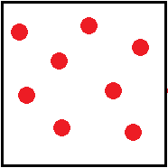 
 
Now imagine how many iterations we would need in a scene like this one:

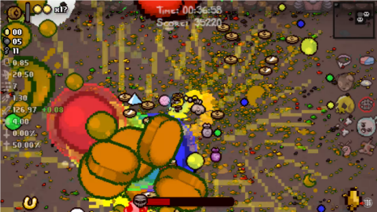 

And that’s where spacial partitioning appears and saves us.

# Space partitioning

In order to avoid iterations that are not needed (colliders too far from each other, tiles / polygons out of the screen), we can divide the space into different subsets.
 
That process is called space partition. There are a lot of ways to divide the space, and depending on our needs we will choose one or another.
 
* **Quadtrees**: divides the space into 4 subsets, each of them might be divided into 4 subsets, etc.

 

* **Octrees**: similar to the quadtrees, but used in 3D instead of 2D. Each node will have 8 children instead of 4.

 

* **k-d trees**: the space is divided into 2 subspaces, which might not be equal. The “partition lines” are always perpendicular to the coordinates axis.

 

* **AABB Trees**: Creates subspaces for each group of elements we need to check. Mostly used in dynamic entities like collisions.
 
 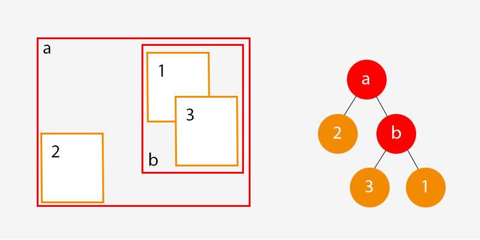 
 
As you cans see in the images above, these data structures translate the space into nodes, which have more subnodes. This structure can be represented in tree diagrams, that's why they are called trees.
 
This are just a **few** ways to part the space explained vrey superficially. There are **a lot more** of them, and honestly, we could spend an entire semester talking about different space partition algorithms, but in this article I’m going to focus on Quadtrees.
 
 
# Quadtrees

As I said before, quadtrees are a data structure that divide the space into 4 sub regions. Each node will have four children, which will have four children each, etc. 

Even though I'm going to use them from a "video game" aproach, they can be used in a lot of fields, such as image compression.

 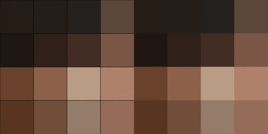 
 *Compression of an image using quadtrees*
 
There are different types of quadtrees, but I will focus on the "Region Quadtrees", which are the most common and I think will be the most usefull in a 2D game.

This quadtree divide the total space into four equal regions, which will be divided into four equal regions and so on until we reach the nodes that are at the bottom of the tree. 

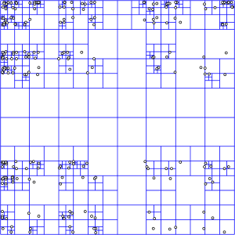 

This type of structure works mostly with recursive fucntions, which the user will call to the main quadtree but then will be called to all its subnodes. 

OK, nice, now we know how quadtrees divide the space, but how can they be usefull in our game?

Let's go back to **particle** systems. Take a look at this images.

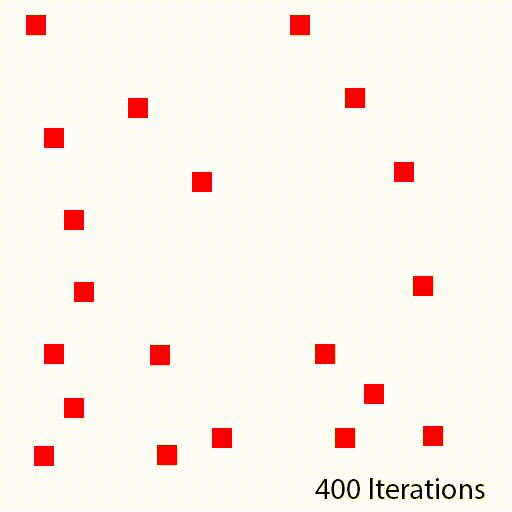 

In the first frame we see how the space is not divided, therefore, we check collisions between all the particles (brute force). And in a system for only 20 particles, we need 400 iterations for each frame. It's important to know that the checks we make increase exponentially as we add more particles: with 10 particles we need 100 iterations, with 20 particles, 400 iterations, with 30 particles, 900 iterations, and so on.

In the second frame the space is divided into four subspaces, and each particle only checks its collision with the other particles in its own subspace. As you can see, it reduces the number of iterations a lot.

And in the third frame, we divide all the previous subspaces that had more than 3 particles. As you can see, there are some subspaces which only have one particle, so we won't even need to check their collision. 

Only by dividing the space twice, improved the performance of our system in a 1279%, by going from 400 iterations each frame to 29. Amazing, right?

### Quadtree structure ###

So, now let me explain superficially which I think are the core elements of a quadtree, and then explain more deeply how I used them in my project.

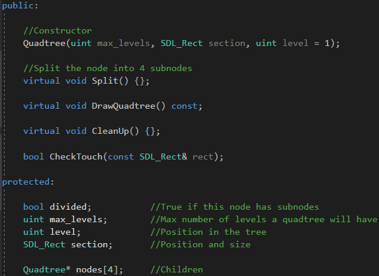 

We will find this elements in any quadtree, no matter what we use them for, some functions might change, but the overall purpose will be the same. Obviously, we will need more methods and variables depending on what we use our quadtrees for, but this would be a nice parent class. 

The fact that some methods are virtual in this header does not mean that they have to be, this is how I made it, but as I said at the beggining, you can find your own way of coding them.

Basically, all we need is a rectangle that tells us the area the node is occupying (**section**).

The **level** and **max_levels** variables tell us in which level the node is in the tree and how much levels can the tree have respectively, so when a node's level is equal to max_levels, it won't be divided under any circumstance.

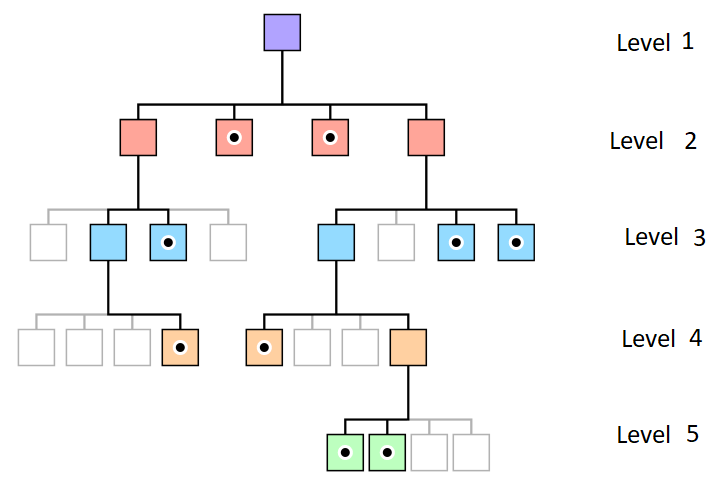 

And obviously, an array with all the **subnodes**.

When it comes to the methods, the most important one is the **Split()**, which will divide the node into 4 subnodes.

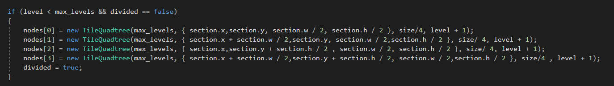 

The **CheckTouch()** tells us if a rectangle fits or not to the current node (I know the name is pretty bad, I apologize).

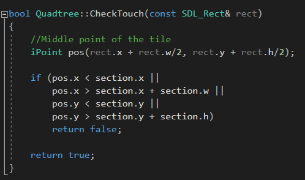 

Then we have the **DrawQuadtree()** which, guess what, is going to draw the quadtrees.

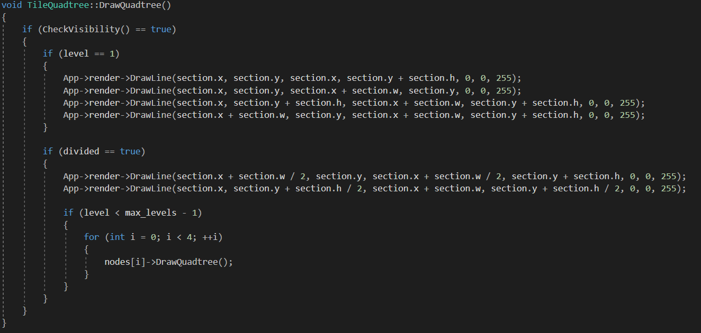 

And obviously the constructor and the cleanup.

### Camera culling with quadtrees ###

So, even thought all my examples were about particles and collisions, I used quadtrees for the camera culling of my game. I didn't mention it because i'll talk about it a little bit more deeply here.

When we are playing a video game, we don't need to render all the map, in fact, we must not, because it's a waste of time. As I said at the beggining, if the map isn't really big, it's not a big deal, but most of the cases it won't be like that, and especially in tiled maps we need to optimize the render process.

Let me put into situation. Let's say I'm developing an RTS with a map of 256x256 tiles. That's a total amount of 65.536 tiles, from which only 500 will appear in the screen, more or less. So, how do we print only the tiles that appear in the screen?

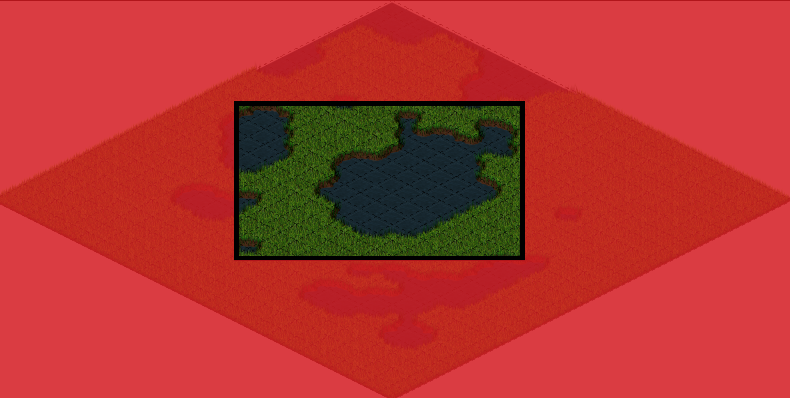 

The first solution that might come to our minds is to put a condition before drawing each tile to make sure they appear in the screen, right? **WRONG** We don't want to do that, that's brute force, we're still checking all the tiles. 

What we want to do is to only go across those tiles that appear int the screen, instead of going across all of them and only printing those that are in the screen. How do we do that?

I will create a quadtree in which i will store all the tiles distributed among all the nodes. Unlike particles, tiles are static, so I will only need to place them once. I will store the tiles in the nodes that are at the **bottom of the tree**, so I don't need to create more nodes and alocate data during the update phase.

Before, I showed you a screenshot of what the header of a quadtre would look like. To do this i will create a children class from that one. The header looks like this:

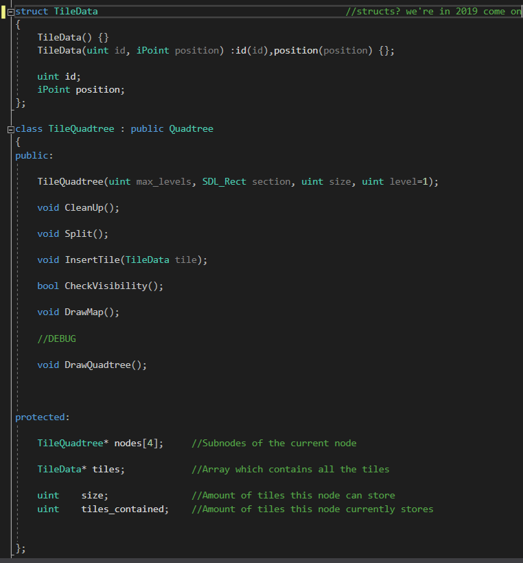 

First of all, I've created a struct called **TileData** which will store the position and ID of a tile. There will be one of them for each tile in the map. Each node will have a dinamic array in order to store them, but as I said before, I will only store the tiles in the nodes located at the bottom of the tree, so the arrays of the nodes that are not at the bottom will be **NULL**.

The **size** of the node will tell us how many tiles it can store, and **tiles_contained** how many it actually stores.

I've also added two functions:

**CheckVisibility()** will return true if the node is in the screen, and false if it does not.

**DrawMap()** if the node has children, what means it is not at the bottom of the tree, it will check if they are on the screen. each node in the screen will call it, if they are not they won't. When a node located at the bottom of the tree calls it, it will draw the tiles stored in his array.

#### Try to do it by yourself! ####

### Quadtree Performance Test
 [Click Here!](https://carlosupc.github.io/Quadtree-Performance-Test/)
### Quadtree Dyn-Collision Performance Test
 [Click Here!](https://carlosupc.github.io/Quadtree-Collision-Performance-Test/)
 
### BRUTE FORCE PERFORMANCE
 

 
 
Debug Info:

### QUADTREE PERFORMANCE

Debug Info:

