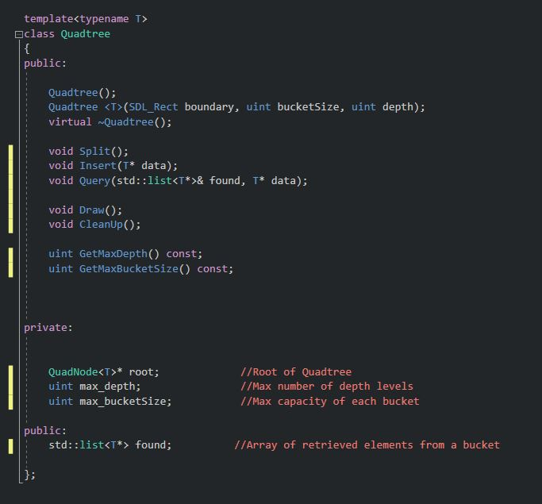
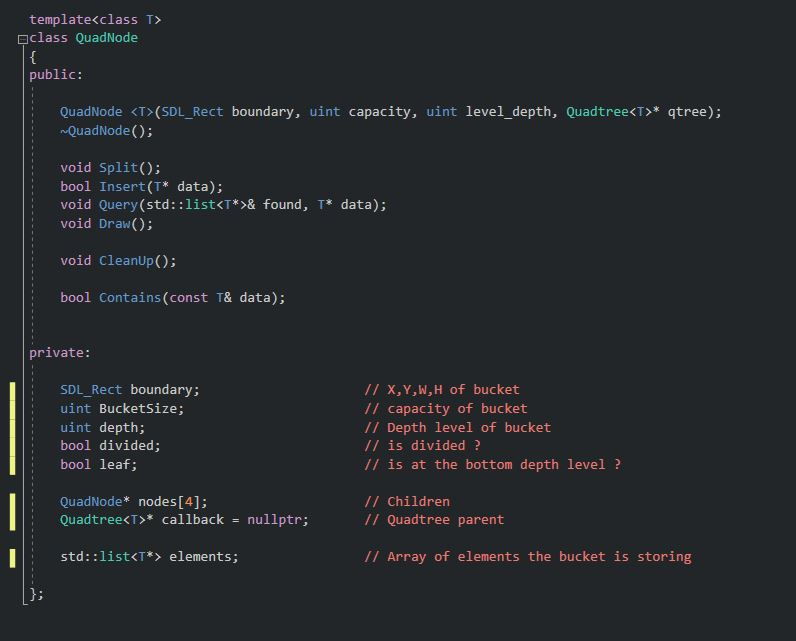
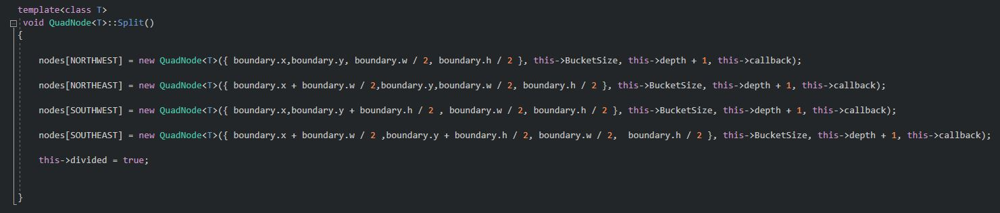
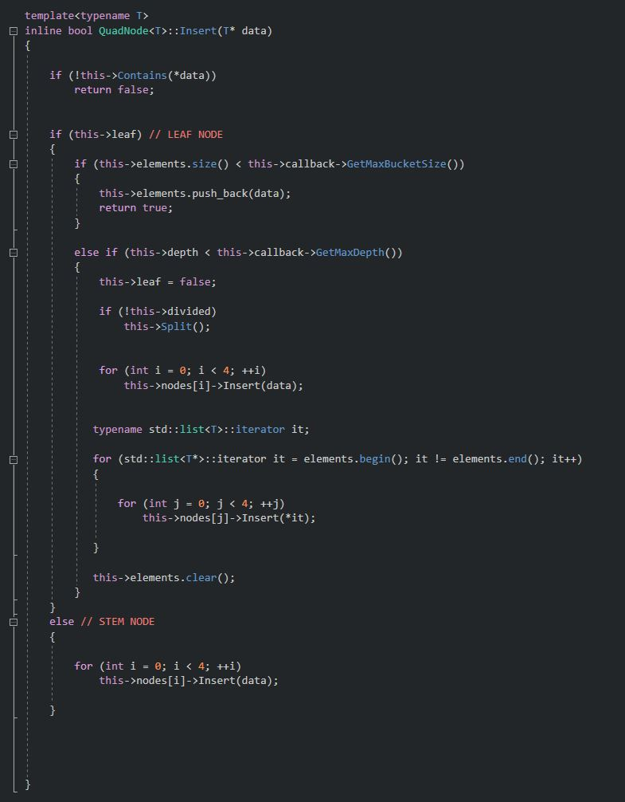
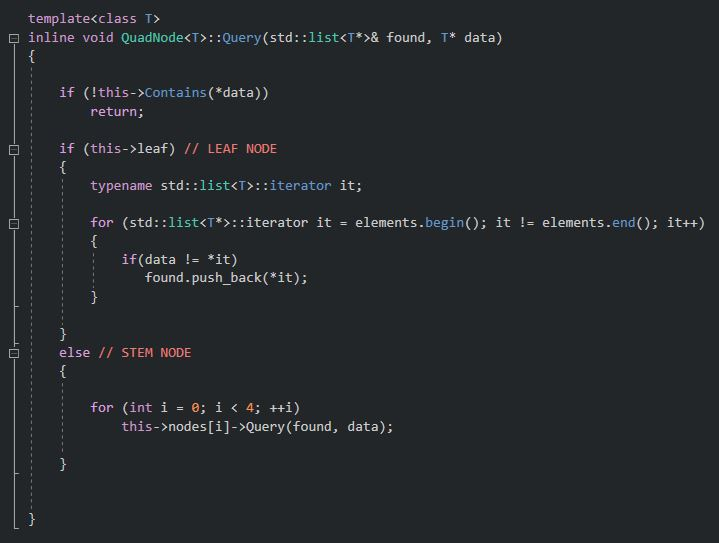
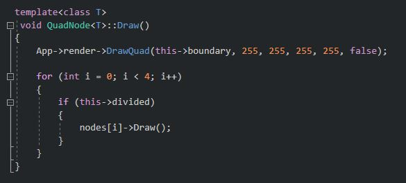

I am [Carlos Peña Hernando](https://www.linkedin.com/in/carlos-pe%C3%B1a-hernando-aa757aaa/), student of the [Bachelor’s Degree in Video Games by UPC at CITM](https://www.citm.upc.edu/ing/estudis/graus-videojocs/). This content is generated as a game development research for learning purposes at my free time.

## Search Conception

First of all, in order to talk about the topic we are here, It is very important to start with a brief introduction about the concept of "search" in the computational world. The concept of search comes from search engine/ tool code which, as the name implies, searches for certain types of elements in an area of the space. 

This search stick to a rule or rules, such as "search for all elements found at a radius X of this point" , "Search for the element closest to this point", ... Starting from these rules of searching, there are different ways to sort the space to perform the search.


## Application in Videogame

Search engine is a fundamental tool which at the time was used and nowadays is still used to simulate so many features that have archieved very positive results in videogames.

For example, in a game like Age of Empires, if you tell a villager to "cut down trees to get wood," the villager from the position where he is will look for the nearest tree and when he finds it with the search engine, a pathfinding algorithm will be performed to go to the tree. Once it is finished, if the order has not been revoked, you can search for a nearby tree on a radius with the search engine and retrace the pathfinding to this one, if it does not find any, you can tell it to look for the nearest building and shelter, again with the search engine, but instead of looking for tree entities, look for building entities. 

Another example may be tower defense games. There are enemies that are advancing in a route, and the towers of defense look for with the engine, enemies that are in range of attack, if so, they attack. Once you have eliminated the target, look for another enemy in range, if there is one, attack, if not, keep doing checks on each frame or every X frames in the search for another enemy.


## Issue's Point

Applied to video games, if we want to find a type of entity of the world in a limited area/range, such as to check collisions, render tile maps, render 3D objects, etc. The first solutions that comes to our mind will usually be an exhaustive search, also called **brute force search.**
 
As its name says, this algorithms are generally **problem-solving**, but they scale with the size of candidates they have to check., working OK with a low amount of them but making our game **unplayable if the amount is high**.
 
For example, in order to check the collisions of the particles of the system in the image, if we used a brute force algorithm, we would check each particle colliding with the others, no matter their position.

If we are working with a low amount of particles like in this image, we would iterate 72 (8x8) times each frame. But let’s say we are working with 100 particles, we would need 10.000 (100x100) iterations each frame.

<p align="center">
<br>
</p>

In case that we have 1000 collision, we are talking about 1000 * 1000 = 1.000.000 checks and so on. Thus, we can see that the check collisions have a cost of elements^2.

So, now imagine how many iterations we would need in a scene like this one:

<p align="center">
<br>
</p>

A really big headache, don't you think?

That’s where **spatial partitioning algorithms** appears to save this issue :)

# Space partitioning

In order to avoid iterations that are not needed (colliders too far from each other, tiles / polygons out of the screen), we can divide the space into different subsets.
 
That process is called space partition. There are a lot of ways to divide the space, and depending on our needs we will choose one or another.

* **BSP (Binary Search Partition)**: First used in *Doom*, to optimize the process and ordering by distance. It cuts the space in hyperplanes and keep branching top/bottom of the plane.

<p align="center">
<br>
</p>

* **QUADTREE**: divides the space into 4 subsets, each of them might be divided into 4 subsets, etc.

<p align="center">
<br>
</p>

* **OCTREE**: similar to the quadtrees, but used in 3D instead of 2D. Each node will have 8 children instead of 4.

<p align="center">
<br>
</p>

* **K-D TREE**: the space is divided into 2 subspaces, which might not be equal. The “partition lines” are always perpendicular to the coordinates axis.

<p align="center">
<br>
</p>

* **AABB TREE**: Creates subspaces for each group of elements we need to check. Mostly used in dynamic entities like collisions.

 <p align="center">
 <br>
 </p>
 
As you cans see in the images above, these data structures translate the space into nodes, which have more subnodes. This structure can be represented in tree diagrams, that's why they are called trees.
 
This are just a **few** ways to part the space explained vrey superficially. There are **a lot more** of them, and honestly, we could spend an entire semester talking about different space partition algorithms, but in this article I’m going to focus on Quadtrees.
 


# QUADTREES

As a approached method to work with, Quadtree is the space partitioning algorithm i choose to develop an optimized collision system you can find in the demo application i made in my [repository]().

As I said before, quadtrees are a data structure that divide the space into 4 sub regions. Each node will have four children, which will have four children each, etc. 

Even though I'm going to use them for a "videogame" aproach, they can be used in a lot of fields, such as image compression.

<p align="center">
 <br>
  </p>
  

## Quadtree's Approaches
The main cases where Quadtree comes to are the following ones:

* **Camera Culling**: Instead of showing the tiles from the map that belong to the camera by doing an exhaustive search (which is highly uneficient) we use the QuadTree structure. This lets us achieve a cost of n * log(base 4) n (being n the size of the map). We make this happen by recursively checking one fourth of the map with our camera boundaries. If there is any overlaps we divide this quarter in 4 pieces again. We continue doing this until we reach the maximum number of divisions set by the programmer. By doing this we end up having the tiles that must be shown on camera and a few extra ones to have a margin and not have any tile being cut. As a fact, the QuadTree that we use is a static type of data structure. This is because we save the map tiles inside of it once we load the map. Then we only have to reffer to the QuadTree to acces the desired tile/s.

* **Collision Checking**: This case is more difficult than camera culling because the set of tiles is static but entities and particles are dynamic. In this case we need to create a dynamic QuadTree that always changes along with entities. This it's slower than the quadtree mentioned before but it's faster than the exhaustive method.

 
 ## Region-Point Quadtree
 
There are different types of quadtrees, but I will focus on the **Region-Point Quadtrees**, which are the most common and I think will be the most useful in a 2D game.

This quadtree divide the total space into four equal regions, which will be divided into four equal regions and so on until we reach the nodes that are at the bottom of the tree. 

<p align="center">
<br>
   </p>

Quadtree subdivisions:

<p align="center">
<br>
   </p>
   
## Quadtree's Goal
This type of structure is more related to recursive functions system since Quadtree starts working in its first quad level (also called as root) and from that root, recursively it calls its subnodes until we reach the last level depth / bottom level of the Quadtree.

Once Quadtree is explained, we know how quadtrees work at a concept view, but how can quadtrees fit in our game? in other words, what's the goal of quadtree in our game? 

Let's put forward this question with the following image:

<p align="center">
<br>
</p>
  
* In the first frame we see how the space is not divided, therefore, we check collisions between all the particles (brute force). And in a system for only 20 particles, we need 400 iterations for each frame. It's important to know that the checks we make increase exponentially as we add more particles: with 10 particles we need 100 iterations, with 20 particles, 400 iterations, with 30 particles, 900 iterations, and so on.

* In the second frame the space is divided into four subspaces, and each particle only checks its collision with the other particles in its own subspace. As you can see, it reduces the number of iterations a lot.

* And in the third frame, we divide all the previous subspaces that had more than 3 particles. As you can see, there are some subspaces which only have one particle, so we won't even need to check their collision. 

Only by dividing the space twice, improved the performance of our system in a **1279%**, by going from 400 iterations each frame to **29 iterations**. Incredible, right?

This goal, is indeed the main ambition from myself to archieve an optimized Collision checking using a Region-Point Quadtree


## Quadtree code structure 

So, now let me explain superficially which I think are the core elements of a quadtree, and then explain more deeply how I used them in my project.


### Quadtree Performance Test
 [Click Here!](https://carlosupc.github.io/Quadtree-Performance-Test/)
### Quadtree Dyn-Collision Performance Test
 [Click Here!](https://carlosupc.github.io/Quadtree-Collision-Performance-Test/)
 

### Quadtree container
 <p align="center">

</p>

### QuadNode container
<p align="center">

</p>

### QuadNode functions:

### Split()
<p align="center">

</p>

### Insert()
 <p align="center">

</p>


### Query()
 <p align="center">

</p>

### Draw()
  <p align="center">

</p>
 
## TODO's and Solutions

### TODO0: XML Configuration

### Solution:
```cpp

bool j1Collision::Awake(pugi::xml_node& config)
{
	qtree_rect.x = config.child("quadtree").attribute("qt_x").as_float();
	qtree_rect.y = config.child("quadtree").attribute("qt_y").as_float();
	qtree_rect.w = config.child("quadtree").attribute("qt_width").as_float();
	qtree_rect.h = config.child("quadtree").attribute("qt_height").as_float();

	capacity = config.child("quadtree").attribute("capacity").as_int();
	depth = config.child("quadtree").attribute("depth").as_int();

	return true;
}

 ```
 ### TODO1: Create Pointer

### Solution: 
```cpp

bool j1Collision::Start()
{
	qtree = new Quadtree<Collider>({qtree_rect.x, qtree_rect.y, qtree_rect.w, qtree_rect.h}, capacity, depth);
	return true;
}

 ```
 
### TODO2: Split nodes

### Solution:
```cpp

template<class T>
 void QuadNode<T>::Split()
{

	nodes[NORTHWEST] = new QuadNode<T>({ boundary.x,boundary.y, boundary.w / 2, boundary.h / 2 }, this->BucketSize, this->depth + 1, this->callback);

	nodes[NORTHEAST] = new QuadNode<T>({ boundary.x + boundary.w / 2,boundary.y,boundary.w / 2, boundary.h / 2 }, this->BucketSize, this->depth + 1, this->callback);

	nodes[SOUTHWEST] = new QuadNode<T>({ boundary.x,boundary.y + boundary.h / 2 , boundary.w / 2, boundary.h / 2 }, this->BucketSize, this->depth + 1, this->callback);

	nodes[SOUTHEAST] = new QuadNode<T>({ boundary.x + boundary.w / 2 ,boundary.y + boundary.h / 2, boundary.w / 2,  boundary.h / 2 }, this->BucketSize, this->depth + 1, this->callback);

	this->divided = true;

}

 ```

### TODO3: Insert()

### Solution:
```cpp
template<typename T>
 inline bool QuadNode<T>::Insert(T* data)
 {

	 if (!this->Contains(*data))
		 return false;


	 if (this->leaf) // LEAF NODE
	 {
		 if (this->elements.size() < this->callback->GetMaxBucketSize())
		 {
			 this->elements.push_back(data);
			 return true;
		 }

		 else if (this->depth < this->callback->GetMaxDepth())
		 {
			 this->leaf = false;

			 if (!this->divided)
				 this->Split();


			 for (int i = 0; i < 4; ++i)
				 this->nodes[i]->Insert(data);
					

			typename std::list<T>::iterator it;

			for (std::list<T*>::iterator it = elements.begin(); it != elements.end(); it++)
			{

				for (int j = 0; j < 4; ++j)
					this->nodes[j]->Insert(*it);	

			}

			this->elements.clear();
		 }
	 }
	 else // STEM NODE
	 {

		 for (int i = 0; i < 4; ++i)
			 this->nodes[i]->Insert(data);
				
	 }


 }
 ```
 ```cpp
 
 double j1Collision::QuadTreeChecking()
{
	double quadTreeTime;
	quadTreeTimer.Start();

	
	qtree->CleanUp();

	for (std::list<Collider*>::iterator it = colliders.begin(); it != colliders.end(); it++) 
		qtree->Insert(*it);

		
	quadTreeTime = quadTreeTimer.ReadMs();
	return quadTreeTime;
}
  ```
### TODO4: Query()

### Solution:
```cpp

template<class T>
 inline void QuadNode<T>::Query(std::list<T*>& found, T* data)
 {

	 if (!this->Contains(*data))
		 return;

	 if (this->leaf) // LEAF NODE
	 {
		 typename std::list<T>::iterator it;

		 for (std::list<T*>::iterator it = elements.begin(); it != elements.end(); it++)
		 {
			 if(data != *it)
				found.push_back(*it);
		 }

	 }
	 else // STEM NODE
	 {

		 for (int i = 0; i < 4; ++i)
			 this->nodes[i]->Query(found, data);

	 }


 }
 
 ```
### TODO5: Check Collision
 ### Solution:
 ```cpp
 
double j1Collision::QuadTreeChecking()
{
	double quadTreeTime;
	quadTreeTimer.Start();

	
	qtree->CleanUp();

	for (std::list<Collider*>::iterator it = colliders.begin(); it != colliders.end(); it++) 
		qtree->Insert(*it);

		

	quadTreeChecks = 0;

	for (std::list<Collider*>::iterator it = colliders.begin(); it != colliders.end(); it++)
	{
		qtree->found.clear();
		qtree->Query(qtree->found, *it);

		if (qtree->found.size() > 0)
		{
			LOG("Colliders near found: %i", qtree->found.size());

			for (std::list<Collider*>::iterator it2 = qtree->found.begin(); it2 != qtree->found.end(); it2++) 
			{
				if ((*it)->CheckCollision((*it2)->rect)) {

					if (matrix[(*it)->type][(*it2)->type] && (*it)->callback)
						(*it)->callback->OnCollision((*it), (*it2));

					if (matrix[(*it2)->type][(*it)->type] && (*it2)->callback)
						(*it2)->callback->OnCollision((*it2), (*it));

				}
				quadTreeChecks++;
				
				App->render->DrawQuad((*it2)->rect, 0, 255, 0, 255, false);
				App->render->DrawLine((*it)->rect.x + (*it)->rect.w / 2, (*it)->rect.y + (*it)->rect.h / 2, (*it2)->rect.x + (*it2)->rect.w / 2, (*it2)->rect.y + (*it2)->rect.h / 2, 0, 255, 255, 255);
			}

		}

	}

	quadTreeTime = quadTreeTimer.ReadMs();
	return quadTreeTime;
}

 ```
### TODO5: Draw() & CleanUp()

 ### Solution: 
  ```cpp
  if(debugQT)
		qtree->Draw();
  ``` 
  
   ```cpp
qtree->CleanUp();
	delete qtree;
	qtree = nullptr;
  ``` 
  
  
# RESULTS
 
### BRUTE FORCE PERFORMANCE
 
<p align="center">

</p>
 
 
Debug Info:

<p align="center">

</p>

### QUADTREE PERFORMANCE

<p align="center">

</p>

Debug Info:

<p align="center">

</p>
